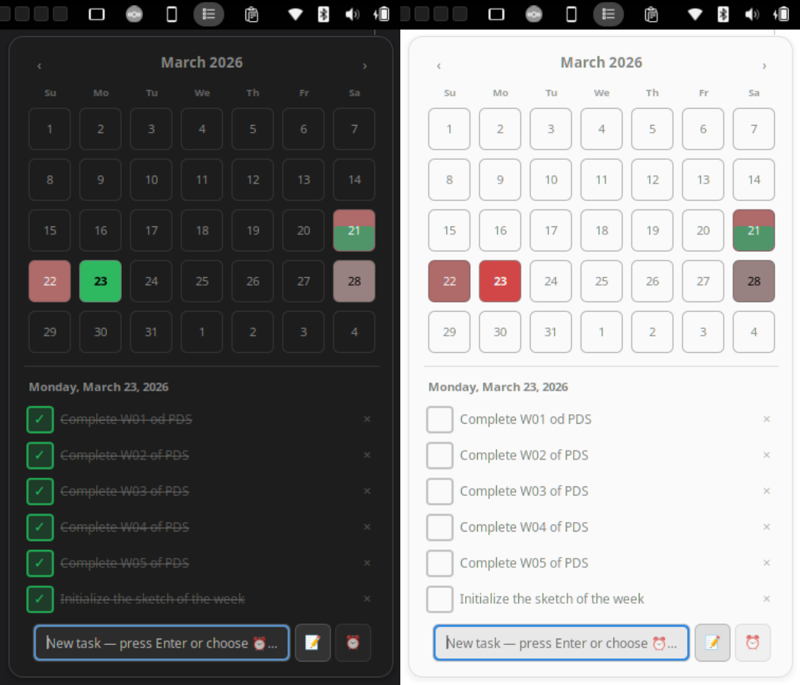

# TaskMan — GNOME Shell Extension

> A calendar-integrated daily task manager and reminder system for the GNOME panel.




---

## Overview

TaskMan lives in your GNOME panel and gives you a full calendar-integrated task and reminder workflow without opening any separate app. Click the panel icon, pick a day, add tasks, set reminders — all without leaving your desktop.

- **Calendar heat map** — every day cell fills with red-to-green color encoding how many tasks you have and how many are done, so your whole month is readable at a glance.
- **Timed reminders** — set a reminder with quick presets (+15m, +30m, +1h, +2h) or an exact HH:MM time. A native GNOME notification fires at the right moment with **Snooze** and **Dismiss** actions.
- **Past-day read-only view** — navigate back to any previous day to review what was completed without accidentally editing it.
- **Plain JSON storage** — all data lives in `~/.local/share/taskman-utkarsh-brainstorm.github.io/data.json`. Back it up, sync it with rsync, or edit it by hand.
- **Theme-aware** — tested on both light and dark Adwaita. Uses `color: inherit` throughout so it respects your shell theme.

---

## Requirements

| Requirement | Version            |
| ----------- | ------------------ |
| GNOME Shell | 48 or 49           |
| GLib / GIO  | Bundled with GNOME |

---

## Installation

### From extensions.gnome.org (recommended)

Once published, visit the extension page and toggle it on:

**https://extensions.gnome.org/extension/taskman@utkarsh-brainstorm.github.io**

### Manual installation

```bash
# Clone the repo
git clone https://github.com/utkarsh-brainstorm/TaskMan.git

# Copy into your local extensions directory
mkdir -p ~/.local/share/gnome-shell/extensions/taskman@utkarsh-brainstorm.github.io
cp TaskMan/{extension.js,prefs.js,constants.js,stylesheet.css,metadata.json} \
   ~/.local/share/gnome-shell/extensions/taskman@utkarsh-brainstorm.github.io/

# Restart GNOME Shell (X11 only — on Wayland, log out and back in)
Alt+F2 → type r → Enter

# Enable the extension
gnome-extensions enable taskman@utkarsh-brainstorm.github.io
```

---

## Usage

### Adding a task

1. Click the **TaskMan** icon in the panel (📋 list icon).
2. The calendar opens on today. Click any future day to switch to it.
3. Type your task in the entry field and press **Enter**.

### Setting a reminder

1. Click the **⏰** toggle button next to the entry field to switch to reminder mode.
2. Type the reminder text in the entry field.
3. Either click a quick-preset button (**+15m**, **+30m**, **+1h**, **+2h**) or type an exact time in **HH:MM** format and press **✓**.
4. A native notification will fire at the scheduled time with **Snooze 5 min** and **Dismiss** actions.

### Navigating the calendar

- Click **‹** / **›** in the calendar header to move between months.
- Days with tasks show a color fill: red = incomplete tasks, green = completed. The more saturated, the more tasks that day has.
- Past days are read-only (shown with a 🔒 banner).

### Preferences

Open **GNOME Extensions** → TaskMan → **Settings** (gear icon) to:

- View the UUID and current version.
- See the path to your data file and open the containing folder.
- **Clear all data** (with a confirmation dialog — this cannot be undone).

---

## Data & Privacy

All data is stored **locally** in:

```
~/.local/share/taskman-utkarsh-brainstorm.github.io/data.json
```

No network requests are ever made. No data leaves your machine.

If `data.json` is corrupted, the extension backs it up to `data.json.bak` and resets gracefully.

---

## File Structure

```
TaskMan/
├── extension.js      # Main extension logic (panel button, calendar, task list, reminders)
├── prefs.js          # Preferences window (GNOME Extensions settings page)
├── constants.js      # Shared path constants — safe to import from both processes
├── stylesheet.css    # Theme-aware CSS for the popup UI
├── metadata.json     # Extension manifest (UUID, name, supported shell versions)
└── README.md
```

---

## Contributing

Issues and pull requests are welcome at **https://github.com/utkarsh-brainstorm/TaskMan**.

Before submitting a PR:

- Test on both GNOME 48 and 49 if possible.
- Test on both light and dark Adwaita themes.
- Run `journalctl -f -o cat /usr/bin/gnome-shell` while testing to catch any JS errors.

---

## License

MIT © [utkarsh-brainstorm](https://github.com/utkarsh-brainstorm)

---

## Author

**Utkarsh Yadav**

- GitHub: [@utkarsh-brainstorm](https://github.com/utkarsh-brainstorm)
- GNOME Extensions: [utkarsh.rwx](https://extensions.gnome.org/accounts/profile/utkarsh.rwx)
